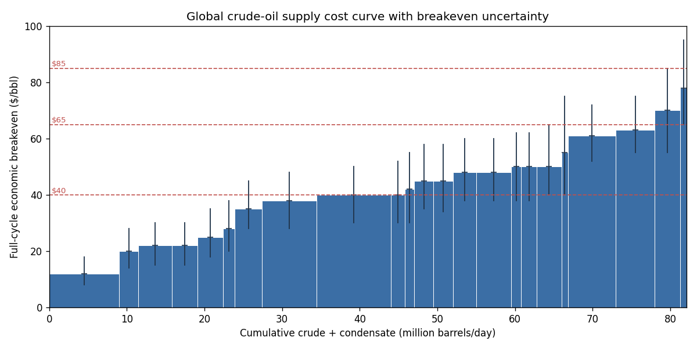
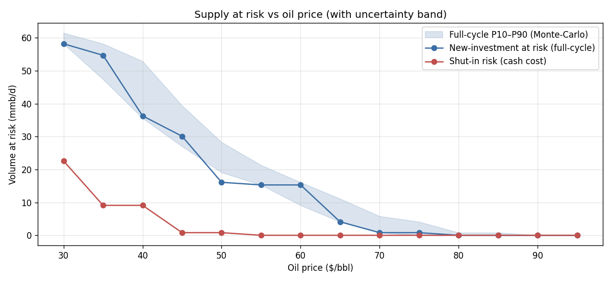
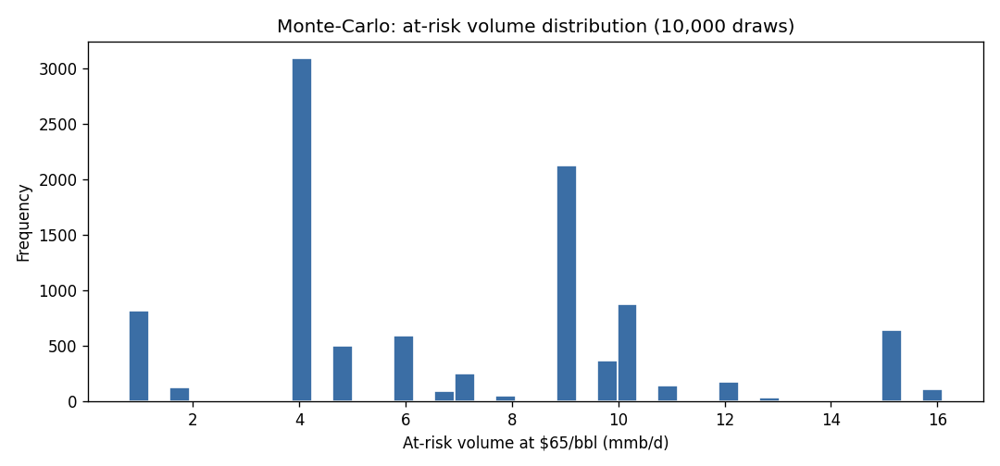
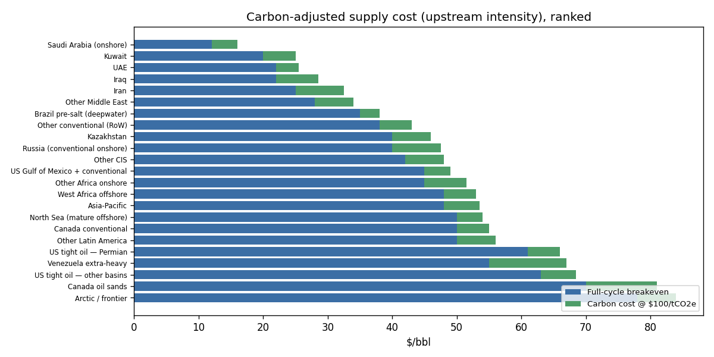

# crude-oil-supply-cost-curve

**Global crude-oil supply cost curve — breakeven benchmarking with uncertainty.**
An energy-market analytical tool that ranks world crude + condensate supply by
*economic* breakeven ($/bbl), builds the cumulative supply cost curve, finds the
marginal barrel that clears demand, and quantifies how much production is uneconomic
at a given oil price — with Monte-Carlo uncertainty, cost-inflation scenarios, and a
written insight memo. Implemented as an **interactive Excel workbook** (live SUMIF)
and an **auditable, unit-tested Python engine** that agree exactly.

Author: **[Pr0spektor](https://github.com/Pr0spektor)**

---

## The question it answers
*"Oil falls to $40/bbl — how much supply is underwater, which segment sets the
marginal price, and where does new investment stop making sense?"* — read straight
off the curve, with the uncertainty around the answer made explicit.

## Headline results (23 publicly-anchored nodes, ~82 mmb/d crude + condensate)

| Oil price | New-investment at risk (full-cycle) | Shut-in risk (cash) | Full-cycle P10–P90 (Monte-Carlo) |
|---|---|---|---|
| **$40** | 36.3 mmb/d (44%) | 6.5 mmb/d | 35.6 – 52.9 |
| **$65** | 4.1 mmb/d (5%) | 0 | 4.1 – 11.1 |
| **$85** | 0 | 0 | 0 – 0.8 |

Marginal barrel to clear ~82 mmb/d demand ≈ **$78/bbl** (Arctic/frontier). A **+15%**
cost shock lifts the marginal barrel to **$90** and at-risk volume at $65 to ~15 mmb/d.
*US-shale nodes use Dallas Fed Q1 2025 breakevens ($61–63 new well; $33–41 shut-in).*





**→ One-page findings: [INSIGHT_MEMO.md](INSIGHT_MEMO.md)** (produced from the model; numbers reconcile).

## What makes it decision-grade
- **Two cost views, not conflated** — full-cycle (new-investment) vs cash cost
  (shut-in), and *fiscal* breakeven explicitly excluded. See [docs/METHODS.md](docs/METHODS.md).
- **Uncertainty, not false precision** — every breakeven carries a (low, high) range;
  Monte-Carlo (10k seeded draws) reports P10/P50/P90 of the at-risk volume.
- **Scenarios** — price stress and cost-inflation grid.
- **Carbon-cost overlay** — an upstream-carbon-intensity ($/tCO2e) lens that re-ranks
  the merit order (transition risk), grounded in Masnadi et al. (2018).
- **Sourced data** — Dallas Fed, EIA, IEA, Rystad, Masnadi *Science* ([SOURCES.md](SOURCES.md)).
- **A model, not just a ranking** — `src/equilibrium.py` clears the market against a
  constant-elasticity demand curve, solving for the equilibrium price/volume (shift demand
  or shock costs and read the new price).
- **Polyglot & reconciled** — the core engine is implemented in **Excel (live formulas +
  VBA), Python, JavaScript and R**, all agreeing on the same results.
- **Validated** — `src/validate.py` asserts data invariants (run in CI).
- **Live-data ready** — `src/fetch.py` refreshes production from the EIA open API
  (cached, with graceful offline fallback to the bundled data; needs `EIA_API_KEY`).
- **Synthesis** — a McKinsey-style insight memo with the "so what".



## Repository layout
```
src/costcurve.py     # engine: curve, marginal barrel, at-risk, Monte-Carlo, inflation (stdlib)
src/equilibrium.py   # market-clearing model: supply curve x demand curve -> clearing price
src/data.py          # 23 sourced supply nodes (production, full & cash breakeven, ranges)
js/costcurve.js      # JavaScript port of the core engine (+ js/costcurve.test.js)
r/costcurve.R        # R port with self-test (Rscript r/costcurve.R)
vba/CostCurve.bas    # Excel VBA module (AtRiskVolume / EconomicVolume / MarginalBarrel)
src/analysis.py      # charts + summary.json + model-driven INSIGHT_MEMO.md
src/build_workbook.py# model.xlsx: Outputs (live SUMIF) · Data · CostCurve · Scenarios · MonteCarlo
tests/test_costcurve.py # 18 unit tests (hand-checked fixtures, seeded Monte-Carlo)
docs/METHODS.md · SOURCES.md · INSIGHT_MEMO.md
```

## Run it
```bash
python src/analysis.py        # charts + memo + summary.json
python src/build_workbook.py  # interactive model.xlsx
python tests/test_costcurve.py   # 18/18, standalone …
pytest -q                        # … or under pytest (CI)
```
Open **`model.xlsx`**, change the oil-price cell on **Outputs** — at-risk volumes
recompute via `SUMIF` (no macros). Verified by recalculating headless in LibreOffice.

## Caveats
Publicly-anchored, simplified (23-node) planning inputs — not a licensed asset-level
database, not investment advice. See METHODS/SOURCES for full provenance and limits.

## License
MIT — see [LICENSE](LICENSE).
